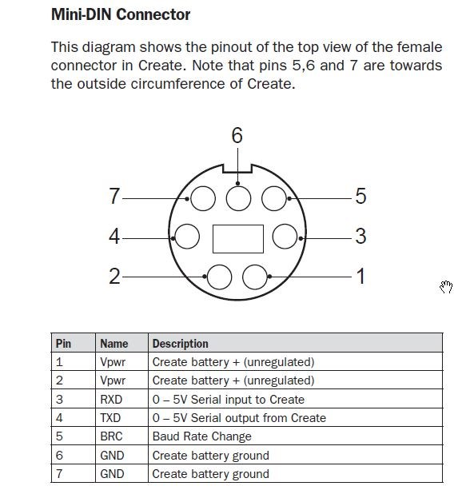

# Roomba control via Arduino Mega

This project controls a Roomba 620 with an Arduino Mega 2560 and the Roomba library

### Connections

| Color | Roomba Pin | Arduino Pin |
| ----------- | ----------- | -- |
| Red | 1 or 2 | Vcc |
| Black | 6 or 7 | GND |
| Green | 4 | TX3 (14) |
| Yellow | 3 | RX3 (15) |
| Blue | 5 | 5 |

If using hardware serial, it is not necessary to level shift.

Max current from each Roomba power pin is 200mA. There is a resetable fuse in the Roomba.

### Arduino Library
See: https://github.com/Apocrathia/Roomba

There are a few other resources online. Just beware that the Roomba Create has a superset of normal Roomba functions!